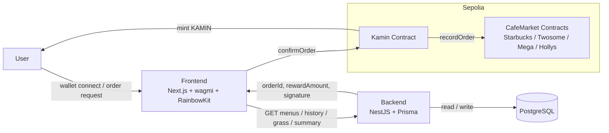
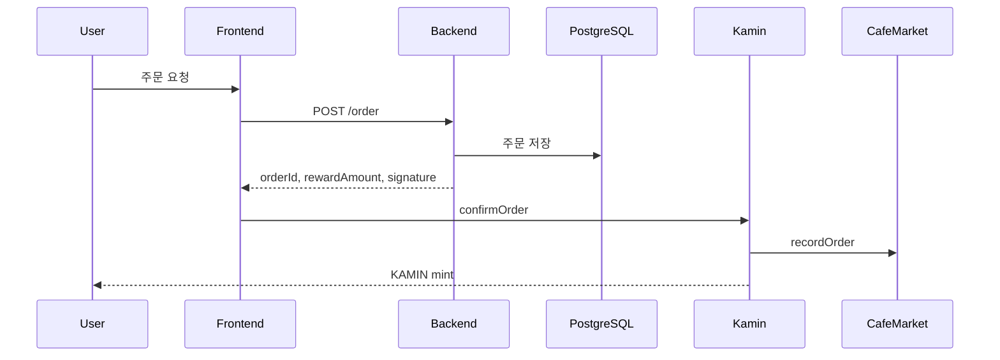

# Kamin

> One wallet, every cafe spend in one view.

Kamin은 여러 프랜차이즈 카페에 흩어진 주문 기록과 소비 데이터를 한곳으로 모아 보여주는 카페 소비 aggregator입니다. 사용자는 브랜드별 앱을 오가며 내역을 확인하지 않아도, Kamin에서 자신의 카페 소비 흐름을 통합적으로 관리할 수 있습니다.

이 프로젝트는 단순한 주문 인터페이스가 아니라, 프랜차이즈별 소비 데이터를 공통 포맷으로 수집하고 연결해 누적 지출, 브랜드별 이용 패턴, 주문 히스토리를 하나의 사용자 경험으로 재구성하는 데 초점을 둡니다. 여기에 온체인 리워드를 결합해, 실제 소비 활동이 곧 디지털 보상으로 이어지는 구조를 제공합니다.

사용자는 지갑을 연결한 뒤 브랜드와 메뉴를 선택하고, 백엔드에서 주문 정보를 생성한 다음, 스마트 컨트랙트에 주문을 확정하는 트랜잭션을 전송합니다. 주문이 성공하면 CafeMarket에 기록이 남고, 보상으로 KAMIN 토큰이 민팅됩니다.

## Problem

기존 카페 소비 경험은 브랜드별 앱, 멤버십, 포인트 체계가 서로 분리되어 있어 사용자가 자신의 전체 소비 흐름을 통합해서 보기 어렵습니다. 주문 내역은 흩어져 있고, 포인트는 브랜드 안에 갇혀 있으며, 사용자는 실제로 얼마나 소비했고 어떤 브랜드를 얼마나 이용하는지 직관적으로 파악하기 어렵습니다.

## Solution

Kamin은 여러 프랜차이즈 카페의 주문 기록과 소비 데이터를 하나의 인터페이스로 연결하는 카페 소비 aggregator입니다. 사용자는 Kamin 안에서 카페를 선택하고 주문을 생성한 뒤, 동일한 흐름으로 거래를 확정할 수 있고, 이 과정에서 주문 데이터는 백엔드와 데이터베이스에 정리되며 온체인에서는 주문 기록과 보상 민팅이 함께 처리됩니다.

Kamin이 제공하는 핵심 가치는 다음과 같습니다.
- 여러 프랜차이즈 카페의 소비 데이터를 한곳에서 조회하는 통합 경험
- 브랜드별 주문 내역과 누적 소비를 같은 기준으로 비교할 수 있는 구조
- 실제 주문 기록을 온체인 활동과 연결하는 투명한 리워드 흐름
- 주문, 기록, 보상 적립이 분리되지 않는 일관된 사용자 여정

## Business Model

Kamin은 주문과 소비 데이터를 통합하는 인터페이스일 뿐 아니라, 브랜드 제휴를 확장할 수 있는 리워드 네트워크의 기반이 됩니다. 제휴 브랜드가 늘어날수록 사용자는 하나의 공통 보상 체계 안에서 더 많은 카페 경험을 연결할 수 있고, 브랜드는 신규 유입과 재방문을 유도할 수 있는 공동 혜택 채널을 확보할 수 있습니다.

특히 공통으로 적립되는 KAMIN 토큰은 향후 브랜드 제휴 구조에 따라 각 브랜드의 자체 포인트처럼 사용하거나 교환할 수 있는 형태로 발전할 수 있습니다. 이는 브랜드별로 단절된 포인트 시스템을 연결하는 공통 정산 및 리워드 레이어로 작동할 수 있으며, 사용자에게는 더 높은 활용성을, 브랜드에게는 제휴 기반의 락인과 마케팅 효율을 제공합니다.

## Growth Vision

Kamin의 장기 목표는 단순한 카페 주문 서비스가 아니라, 분산된 오프라인 소비 경험을 통합하고 디지털 자산화하는 소비 aggregation layer가 되는 것입니다. 더 많은 프랜차이즈와 로컬 카페를 연결하고, 개인화된 리워드, 브랜드 간 혜택 연동, 온체인 멤버십까지 확장함으로써 카페 소비 전반을 아우르는 공통 인프라로 발전할 수 있습니다.

프로젝트는 세 부분으로 구성됩니다.
- `frontend`: Next.js App Router 기반 사용자 인터페이스
- `backend`: NestJS, Prisma, PostgreSQL 기반 주문 API와 서명 생성 서버
- `contracts`: Foundry 기반 스마트 컨트랙트와 배포 스크립트

## Architecture

## Order Flow

