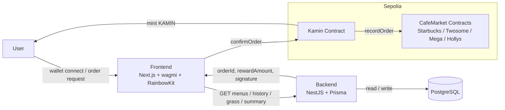
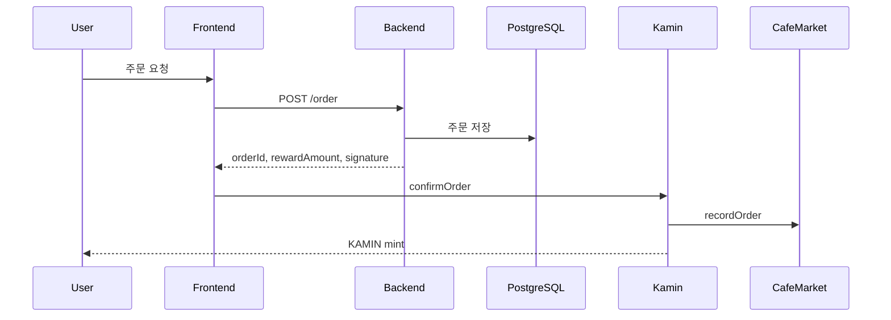

# Kamin

Kamin은 카페 주문 경험과 온체인 리워드 시스템을 연결한 커피 포인트 dApp입니다.
사용자는 지갑을 연결한 뒤 브랜드와 메뉴를 선택하고, 백엔드에서 주문 정보를 생성한 다음, 스마트 컨트랙트에 주문을 확정하는 트랜잭션을 전송합니다. 주문이 성공하면 CafeMarket에 기록이 남고, 보상으로 KAMIN 토큰이 민팅됩니다.

프로젝트는 세 부분으로 구성됩니다.
- `frontend`: Next.js App Router 기반 사용자 인터페이스
- `backend`: NestJS, Prisma, PostgreSQL 기반 주문 API와 서명 생성 서버
- `contracts`: Foundry 기반 스마트 컨트랙트와 배포 스크립트

## Architecture

## Order Flow

