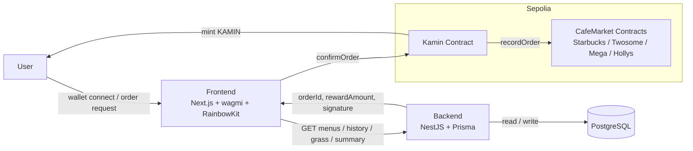
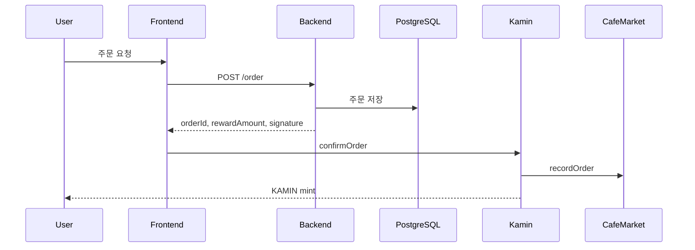

# Kamin Contracts

Sepolia에 배포된 카페 리워드 dApp 컨트랙트입니다.

## Contract Overview

- `Kamin`
  - 주문 확인 시 `KAMIN` 토큰을 민팅하는 메인 컨트랙트
  - 허용된 카페 마켓 주소 관리
  - 백엔드 서명 검증 후 주문 확정

- `CafeMarket`
  - 브랜드별 주문 기록용 마켓 컨트랙트
  - `Kamin`만 `recordOrder`를 호출 가능
  - 주문 이벤트를 남겨서 프론트/백엔드에서 기록 확인 가능

## Sepolia Addresses

- `Kamin`
  - `0x8911C397ABc19635fe0b6B7bD93071d463e67573`

- `StarbucksMarket`
  - `0xb80A6060e3611a0A8A410E2db76B91dC08a5F9b9`

- `TwosomeMarket`
  - `0xB4e6d4c228e5bfd99271eC2E4D664092a429fA4F`

- `MegaMarket`
  - `0x85F1cA2B89C26fe613a010b83456594C4a742C53`

- `HollysMarket`
  - `0x70e98e267f365137157C0E7e5AdD36318Db5502B`

## Architecture

## Order Flow

## Scripts

- `script/Deploy.s.sol`
  - `Kamin`, `Starbucks`, `Twosome`, `Mega`를 한 번에 배포

- `script/DeployHollys.s.sol`
  - 기존 `Kamin`에 연결되는 브랜드로 `HollysMarket`만 추가 배포
