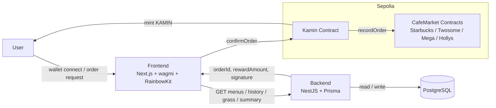
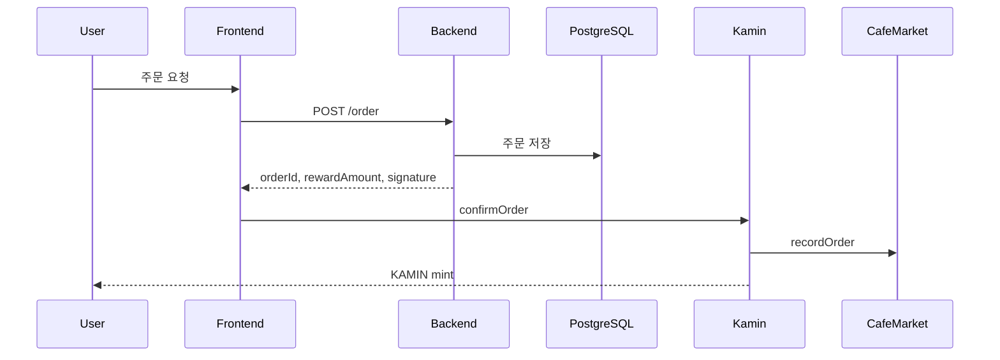

# Frontend

카페 리워드 dApp의 Next.js 프론트엔드입니다.

## 주요 기능

- RainbowKit + wagmi 지갑 연결
- 브랜드 선택 후 메뉴 주문
- `confirmOrder` 컨트랙트 호출
- 주문 히스토리 조회
- 잔디판 형태의 활동 기록 표시

## Tech Stack

- Next.js App Router
- React
- wagmi
- RainbowKit
- viem
- Tailwind CSS

## 실행 방법

### 1. 환경변수 설정

`.env.local`에 아래 값이 필요합니다.

```env
NEXT_PUBLIC_REOWN_PROJECT_ID=YOUR_REOWN_PROJECT_ID
NEXT_PUBLIC_BACKEND_URL=http://localhost:3001
NEXT_PUBLIC_KAMIN_ADDRESS=0x8911C397ABc19635fe0b6B7bD93071d463e67573
NEXT_PUBLIC_STARBUCKS_MARKET_ADDRESS=0xb80A6060e3611a0A8A410E2db76B91dC08a5F9b9
NEXT_PUBLIC_TWOSOME_MARKET_ADDRESS=0xB4e6d4c228e5bfd99271eC2E4D664092a429fA4F
NEXT_PUBLIC_MEGA_MARKET_ADDRESS=0x85F1cA2B89C26fe613a010b83456594C4a742C53
NEXT_PUBLIC_HOLLYS_MARKET_ADDRESS=0x70e98e267f365137157C0E7e5AdD36318Db5502B
```

### 2. 개발 서버 실행

```bash
npm install
npm run dev
```

브라우저에서 `http://localhost:3000`으로 접속합니다.

## 페이지 구성

- `/`
  - 홈 화면
  - 포인트 표시
  - 잔디판 활동 기록
  - 브랜드별 주문 수 / 마켓 주소 표시

- `/order`
  - 브랜드 선택 화면

- `/order/[brand]`
  - 브랜드별 메뉴 주문 화면

- `/history`
  - 주문 히스토리 화면

## Architecture



## Order Flow



## 참고

- 실제 주문/메뉴/히스토리 데이터는 backend API를 통해 받아옵니다.
- 주문 시 backend에서 서명을 생성한 뒤 프론트가 `writeContract`를 실행합니다.
