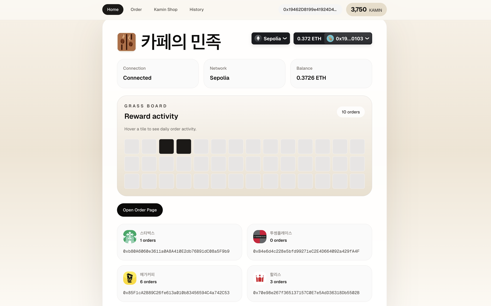
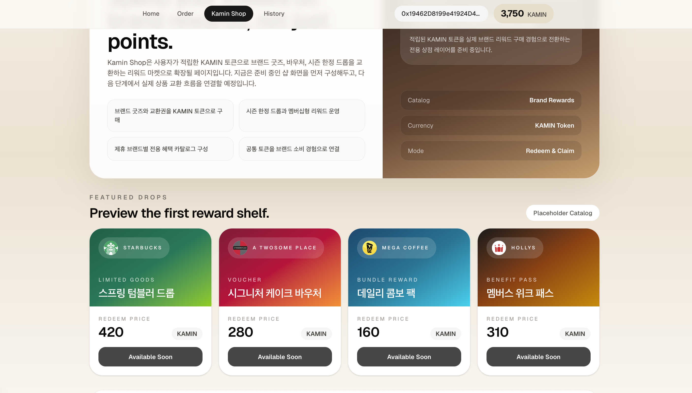
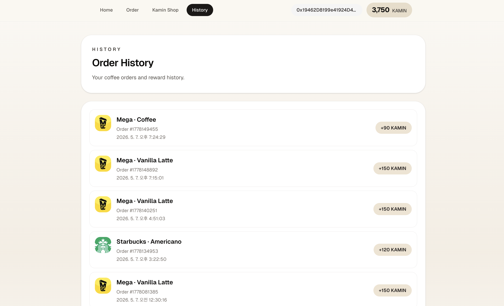
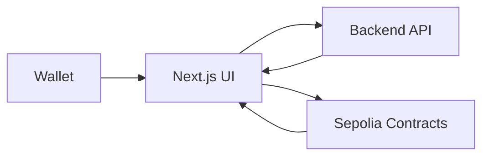

# Kamin Frontend

Kamin의 사용자 인터페이스입니다. 사용자는 지갑을 연결한 뒤 브랜드와 메뉴를 선택하고, 백엔드가 생성한 주문 서명을 받아 컨트랙트에 주문을 확정합니다. 홈에서는 KAMIN 보유량, 활동 기록, 브랜드별 사용 현황을 확인할 수 있습니다.

## Screens

### Home



### Order Brand


### Order Menu


### Shop



### History



## Features

- RainbowKit + wagmi 기반 지갑 연결
- 지갑 주소 기준 사용자 로그인 동기화
- 브랜드 선택 및 브랜드별 메뉴 주문
- 백엔드 주문 생성 API 호출
- `confirmOrder` 컨트랙트 호출
- KAMIN 토큰 잔액 표시
- 주문 히스토리, 활동 잔디판, 브랜드별 요약 표시
- Kamin Shop 페이지 제공

## Tech Stack

- Next.js App Router
- React
- TypeScript
- wagmi
- RainbowKit
- viem
- Tailwind CSS

## Environment Variables

`.env.local` 파일이 필요합니다.

```env
NEXT_PUBLIC_REOWN_PROJECT_ID=YOUR_REOWN_PROJECT_ID
NEXT_PUBLIC_BACKEND_URL=http://localhost:3001
NEXT_PUBLIC_KAMIN_ADDRESS=0x8911C397ABc19635fe0b6B7bD93071d463e67573
NEXT_PUBLIC_STARBUCKS_MARKET_ADDRESS=0xb80A6060e3611a0A8A410E2db76B91dC08a5F9b9
NEXT_PUBLIC_TWOSOME_MARKET_ADDRESS=0xB4e6d4c228e5bfd99271eC2E4D664092a429fA4F
NEXT_PUBLIC_MEGA_MARKET_ADDRESS=0x85F1cA2B89C26fe613a010b83456594C4a742C53
NEXT_PUBLIC_HOLLYS_MARKET_ADDRESS=0x70e98e267f365137157C0E7e5AdD36318Db5502B
```

`NEXT_PUBLIC_BACKEND_URL`은 실행 중인 NestJS 백엔드 주소와 같아야 합니다. 로컬 기본값은 `http://localhost:3001`입니다.

## Run

백엔드와 PostgreSQL을 먼저 실행한 뒤 프론트를 실행합니다.

```bash
npm install
npm run dev
```

브라우저에서 `http://localhost:3000`으로 접속합니다.

## Routes

- `/`: 홈, KAMIN 잔액, 활동 기록, 브랜드별 요약
- `/order`: 브랜드 선택
- `/order/[brand]`: 브랜드별 메뉴 주문
- `/shop`: Kamin Shop
- `/history`: 주문 히스토리

## Frontend Flow


```mermaid
flowchart LR
    Wallet["Wallet"] --> UI["Next.js UI"]
    UI --> API["Backend API"]
    UI --> Chain["Sepolia Contracts"]
    API --> UI
    Chain --> UI
```

## Notes

- 메뉴, 주문 내역, 활동 기록은 backend API를 통해 조회합니다.
- 주문 확정은 프론트에서 직접 서명을 만들지 않고, 백엔드가 반환한 `signature`로 `confirmOrder`를 호출합니다.
- 지갑 연결 후 `POST /users/login`을 호출하므로 백엔드가 꺼져 있으면 브라우저 콘솔에 `Failed to fetch`가 표시될 수 있습니다.
